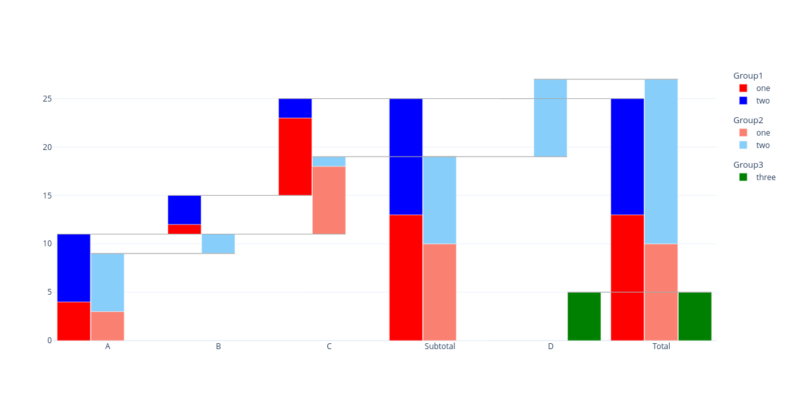

# plotly-waterfall

## Description 

A small package adding simple waterfall plotting capabilities on top of the plotly graphing package. Waterfall graphs are useful to display e.g. financial data such ans cashflow statements in an easily digestible format. 

While plotly includes basic capabilities to plot waterfall graphs, it ships only limited features. This package provides simple, plotly-express-style waterfall graphs with grouping, multiple stacked categories and variable colors. 

## Installation

Use pip3: 

`pip3 install plotlywaterfall`

## Usage

More examples can be found in the example notebook (https://github.com/docdru/plotlywaterfall/blob/main/example.ipynb). Simple example: 

    df = pd.DataFrame({
        "X": ["A", "B", "C"]*4 + ["D", "D" ], 
        # "Y": np.random.randint(0, 10, 6), 
        "Y": [4, 1, 8, 7, 3, 2] + [i-1 for i in [4, 1, 8, 7, 3, 2]] + [8, 5],
        "category": ["one"]*3+["two"]*3 + ["one"]*3+["two"]*3 + ["two", "three"],
        "group": ["one"]*6 + ["two"]*6 + ["two", "three"]
    })

    colors = {
        "one": {"one": "red", "two": "blue"},
        "two": {"one": "salmon", "two": "lightskyblue"},
        "three": "green"
    }

    c = Waterfall(df, x="X", y="Y", category="category", colors=colors, group="group", total=True, subtotals={"C": "Subtotal"})
    fig = c.get_fig()
    fig

produces

## Disclaimer

I might maintain and improve the package. I might also not.

Known open points: 
- It is not possible to have mixed signs per X-value.
- I am note really happy with the interface for defining the colors.
